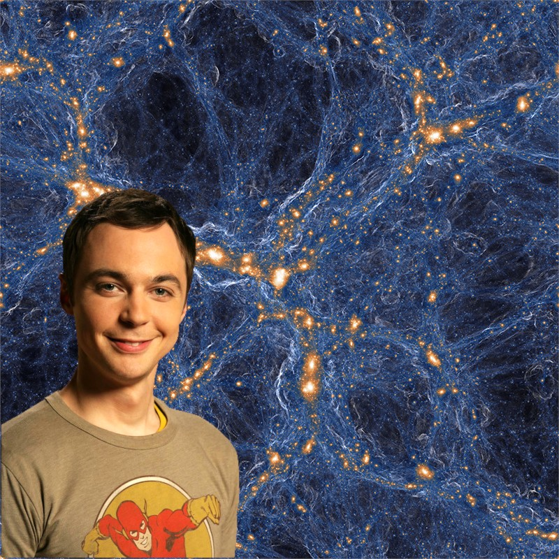

Simulation of galaxies and gas in the universe. Within the gas in the (blue) filaments connecting the (orange) galaxies lurk rare pockets of pristine gas – vestiges of the Big Bang that have somehow been orphaned from the explosive, polluting deaths of stars, seen here as circular shock waves around some orange points. CREDIT: TNG COLLABORATION

\[Jim Parsons inserted by me\]

This is huge! **A group of astronomers**, led by Fred Robert and Michael Murphy of the _Swinburne University of Technology_ in Australia, **[found](http://blogs.discovermagazine.com/d-brief/2018/12/19/fossil-cloud-big-bang-uncontaminated/) a cloud of gas left over from the Big Bang**, using the telescope located at _W. M. Keck Observatory_ on Maunakea, Hawaii. A _dinosaur_ from the past.
