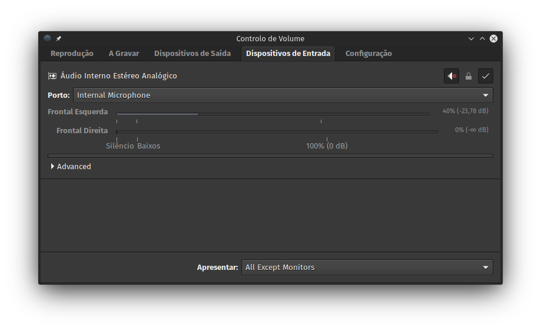

Quer no meu portátil, quer no da esposa, temos um problema irritante com o microfone de cada equipamento quando usamos o _Jitsi Meet_, _Skype_, _Messenger_ e outras aplicações do género. A situação é a seguinte: quando o volume do micro está baixo, não se ouve nada; aumentando, só se ouve distorção que dá uma dor de cabeça horrível.

Andei uns dias de volta do _alsa_ ou do _pulseaudio_, porque pensava que o problema era aí, até que descobri a solução no [askubuntu](https://askubuntu.com/questions/878308/ubuntu-16-04-internal-microphone-not-working-ideapad-310/911564#911564). Resumidamente, basta instalar o _pavucontrol_, ir aos dispositivos de entrada, destrancar os canais do microfone interno e colocar o canal direito a 0.

A imagem abaixo exemplifica o que deve ser feito.

Agora, falta-me ver se dá para aplicar esta alteração _system-wide_, com a edição de algum ficheiro do _pulseaudio_.
