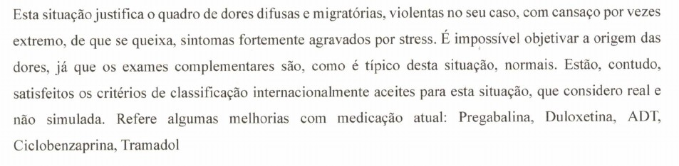

A minha experiência com a fibromialgia tem sido, no mínimo, horrível. E horrível é dizer muito pouco: aquilo por que tenho passado parece tirado de um pesadelo ou de um filme de terror. Não é à toa que o meu reumatologista descreve as dores que sinto como violentas, como podes ver na imagem que se segue.

excerto do relatório

Ao fim de um ano e uns meses, decidi documentar alguns episódios da minha experiência com a fibromialgia. Eu já tinha esta ideia há algum tempo, mas as dores e o consaço constantes fizeram com que a guardasse _na gaveta_ algum tempo.

O [blog](https://fibrohell.github.io/), alojado no Github Pages, abre um pouco a cortina ao pesadelo que vivo. O endereço é [fibrohell.github.io](https://fibrohell.github.io/). O conteúdo está escrito em inglês, para poder chegar a uma audiência maior.
