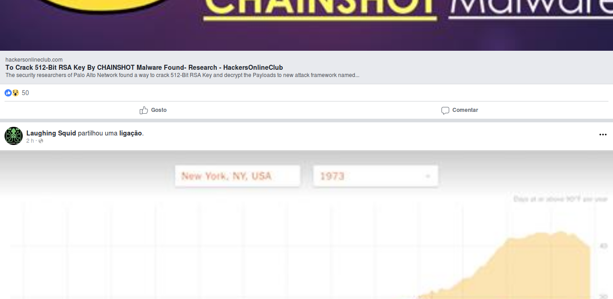

Que raio se passará com o site do _Facebook_? Cada vez demora mais a carregar, faz a temperatura do processador do meu portátil disparar e está cheio de coisas a tentar roubar constantemente um bocadinho da minha atenção. Na volta é por estar cheio de [porcarias](https://www.dailydot.com/debug/facebook-mouse-movements/) como esta.

> Facebook answered 2,000 questions posed by the Senate Committee. Among these, Facebook explained that it collects information about users’ computers, phones, or other connected devices, including their mouse, reports India Today. The main purpose is to personalize content, but mouse movements are also tracked to help the company analyze whether a user is a bot or not. A person’s mouse movements also reveal whether Facebook is open on the foreground or background of their computer—so Facebook knows if you’re actually browsing the site, or merely have it open in one of a dozen different browser tabs.
> 
> Facebook detailed other metrics it tracks about users, as well. It monitors just about everything about the devices that you use to access Facebook. This includes data about what operating system you use, what hardware you’re on, the software version you’re using, and even things such as your cellular signal strength, Bluetooth connectivity, and battery levels. It also looks at the available storage space on your device, file names and types, unique device identifiers, what browser you’re using, and what browser plugins you use.

Seja o que for, a [versão _mobile_](https://m.facebook.com) é mais levezinha. O problema é que a rede social mostra uma versão diferente no _Chrome_ e outra no _Firefox_. A que é mostrada no _browser_ da _Google_ lembra a aplicação _mobile_ e a que aparece no navegador da _Mozilla_ parece um _Revenge of the 90's_. Por algum motivo, o _Facebook_ acha que os utilizadores do _Firefox_ merecem uma versão mais básica do site.

O [https://m.facebook.com](https://m.facebook.com) é esta "bela obra de arte" no _Firefox_

Não percebo...

Eu uso o _Firefox_ e quero a "melhor" versão, por isso a alternativa a mudar de _browser_ é a instalação de uma extensão para alterar o _user agent_, como a [_Chameleon_](https://addons.mozilla.org/en-US/firefox/addon/chameleon-ext/). Isto resolve o problema e aparentemente tudo funciona bem com o site.

Agora que tenho a versão _mobile_ que quero, há outra questão: ela está desenhada para ocupar a janela em toda a largura. Eu tenho o _browser_ sempre maximizado e assim a utilização torna-se no mínimo penosa.

- 
    
    Facebook sem CSS alterado
    
- 
    
    Facebook com CSS alterado
    

Felizmente que há extensões como a [_Stylus_](https://addons.mozilla.org/pt-PT/firefox/addon/styl-us/), que permite escrever regras _CSS_ personalizadas por site. Com umas pequenas alterações à folha de estilo do _mobile.facebook.com_, os elementos passam a ocupar uma largura máxima de 620 pixeis, a zona onde aparece os conteúdos ganha uma sombra e fica centrada na página, o tipo de letra é alterado para o _Open Sans_ e cada publicação fica com os cantos arredondados. Trocando por miúdos, fica com um aspeto mais moderno.

p,
input,
button,
form,
field,
table,
tr,
td,
html {
    font-family: open sans !important;
}

#page {
    max-width: 620px !important;
    margin: 0 auto !important;
}

.\_55wo,
.\_vi6,
.\_6beq,
.\_52z5 {
    border-radius: 4px !important;
    box-shadow: 0px 0px 30px rgba(0, 0, 0, 0.15) !important;
}

.\_5gh8.\_5rgr,
.\_vi6,
.\_6beq {
    margin: 0 0 22px !important;
}

.\_52z5 {
    margin: 8px 0 22px !important;
}

.\_59te {
    border-radius: 4px 0 0 4px !important;
}

Com isto, consigo um interface mais leve para o _Facebook_ e sem ter que usar o _Chrome_ para ter a versão _mobile_ deste século.
