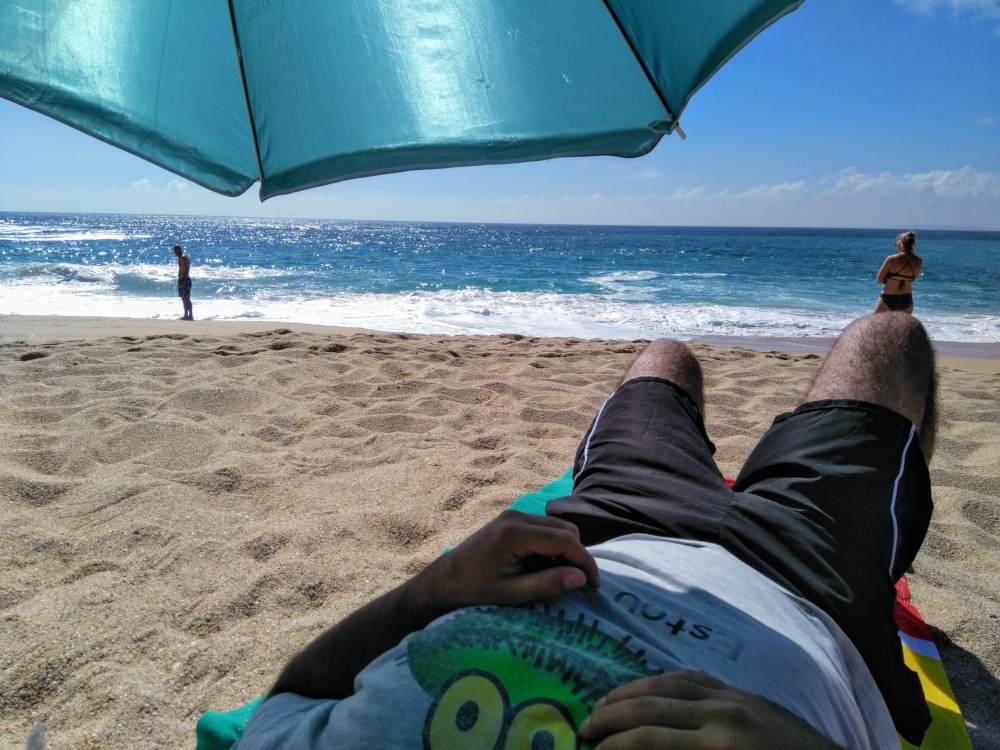
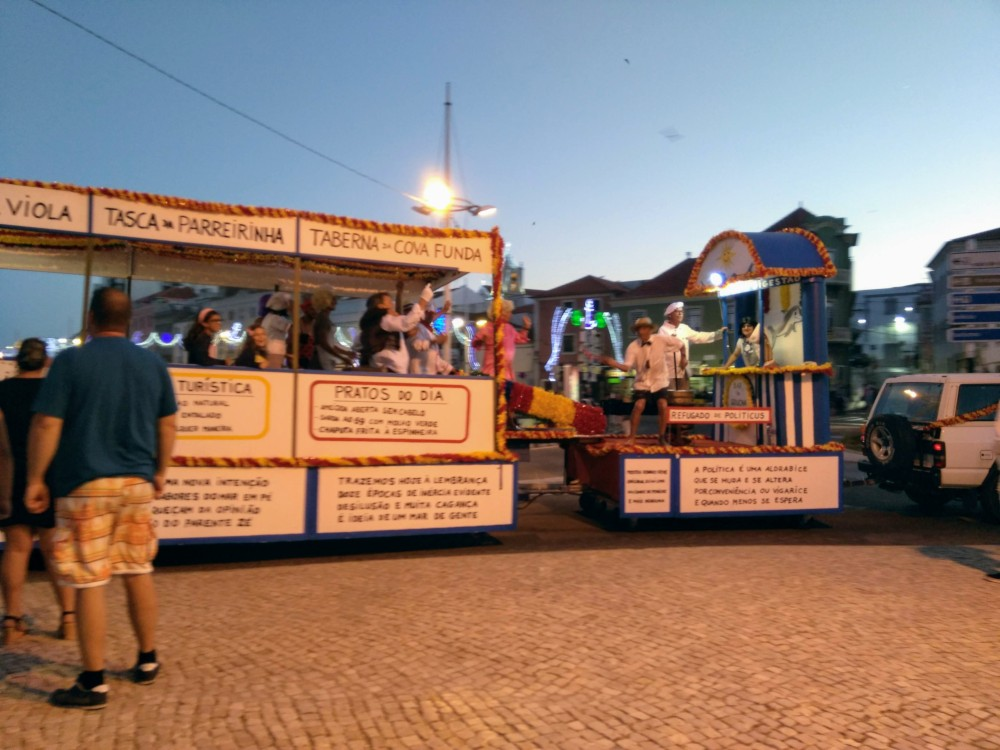
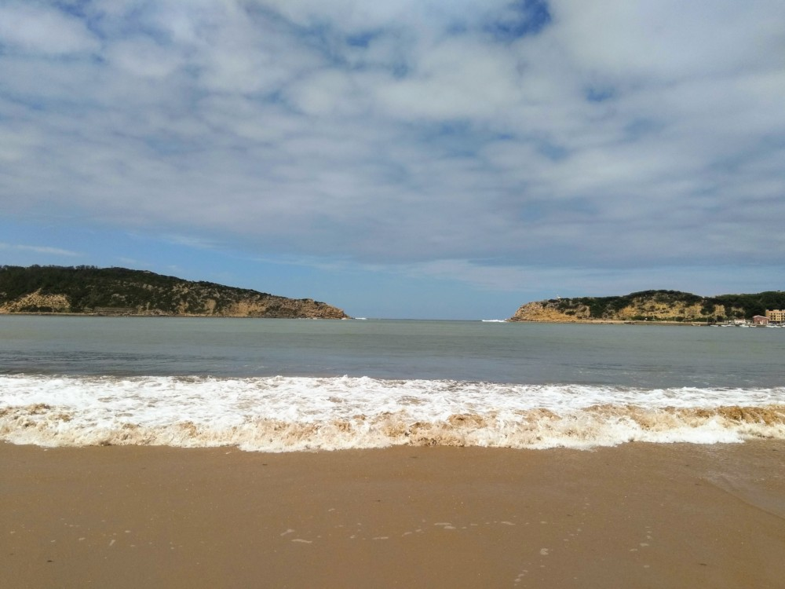

- 
    
    Olha os aviões lá atrás
    
- 
    
    Carnaval de verão de Peniche
    
- 
    
    São Martinho do Porto
    

Chegou ao fim aquele que foi o primeiro de dois fins-de-semana deste verão em que consigo ir passear para a praia. Ele foi passado na Costa Oeste, entre Peniche, Atouguia da Baleia, São Martinho do Porto e mais uns locais.

Estes dois dias foram uma ótima oportunidade para comer peixe grelhado, apanhar um bronze à camionista e ensinar a minha co-piloto a interpretar o mapa que aparece na aplicação _Google Maps_. A parte da interpretação do mapa é um trabalho em progresso e provavelmente nunca vai deixar de o ser, mas houve claras melhorias. ;)  

Através do [_Booking.com_](https://booking.com), conseguimos alojamento a poucos minutos a pé da praia (menos de um minuto de carro) e a um preço realmente acessível. As ligações a diferentes localidades costeiras também eram porreiras, apesar do mau estado de algumas estradas.

No geral, foi uma experiência boa e a repetir. As praias da Costa Oeste têm água mais agradável que as da Figueira da Foz.
