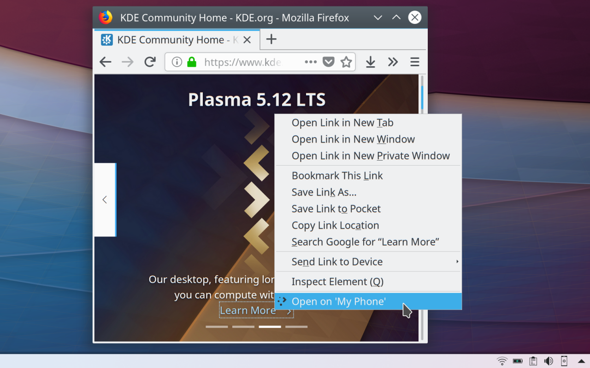
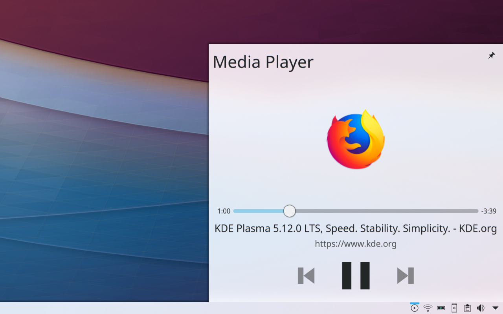

- 
    
    Image from the addon page
    
- 
    
    Image from the addon page
    

Lately, I've been switching between **_Gnome_** and **_Plasma_**. Both are great desktop environments and, like all the other software in the world, both have some shortcomings. So, this is not a flamewar post, nor is intended to start yet another one.

Yesterday, I logged on a _Plasma_ session and opened **_Firefox_** to check my email, social network accounts and read the news. Moments after firing up the browser, I got a _Plasma_ notification about an integration with my browser of choice. I clicked on it and it opened the page for an add-on on the official add-ons website for _Firefox_.

The name of the add-on was **_"[Plasma Integration](https://addons.mozilla.org/en-US/firefox/addon/plasma-integration/)"_**. On the description it read:

> Multitask efficiently by controlling browser functions from the desktop, even while Firefox is in the background. Manage audio and video playback, check downloads in the notification area, send files to your phone using KDE Connect and more inside the KDE Plasma Desktop!

I was struck. This set of functionalities provided by the add-on are what I long wanted for _Firefox_ on a desktop environment, especially the _KDE Connect_ integration.

This means one less shortcoming in the _Plasma Desktop_. So, thank you, _Plasma_ developers and community.
