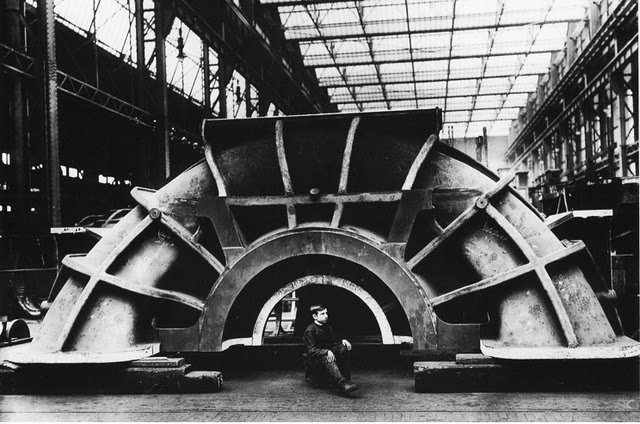
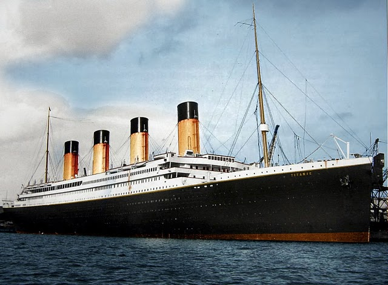

A história do _Titanic_, apesar de trágica, é sobejamente conhecida e já faz parte do mundo do cinema. Menos conhecida é a construção deste barco, que muitos na altura julgavam, com as suas 52.310 toneladas, ser demasiado pesado para flutuar no oceano.

O sucesso na construção do navio, com a estrutura em aço, deu uma boa dose de confiança aos responsáveis. A segurança na qualidade de construção do navio era tanta que chegaram a afirmar que era impossível afundar o _Titanic_.

_Famous last words..._

O sonho deu lugar à realidade quando, na sua viagem inaugural, o navio embateu contra um _iceberg_, causando a morte de mais de 1500 pessoas.

Devido a esta tragédia não podemos visitar o navio, como ainda hoje é possível com outras embarcações antigas. Contudo, a galeria deste _post_ tem 36 fotos tiradas durante a construção do _Titanic_. Através delas, podes ficar a conhecer um bocadinho mais da história deste barco.

- 
    
- 
    
- 
    
- 
    
- 
    
- 
    
- 
    
- 
    
- 
    
- 
    
- 
    
- 
    
- 
    
- 
    
- 
    
- 
    
- 
    
- 
    
- 
    
- 
    
- 
    
- 
    
- 
    
- 
    
- 
    
- 
    
- 
    
- 
    
- 
    
- 
    
- 
    
- 
    
- 
    
- 
    
- 
    
- 
    

_via_ [_How to be a Retronaut_](http://www.howtobearetronaut.com/)
