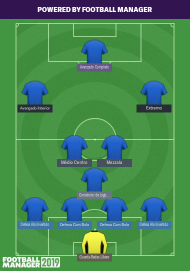
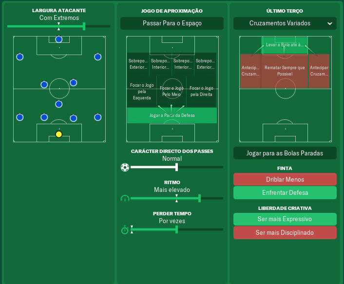
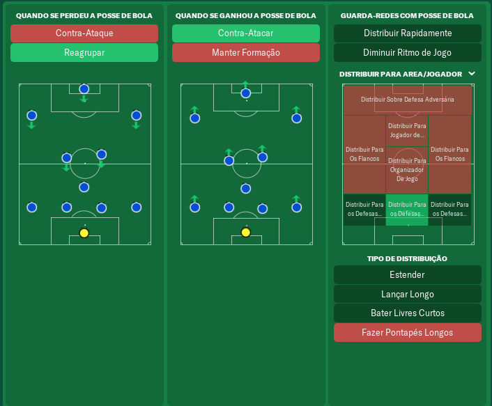
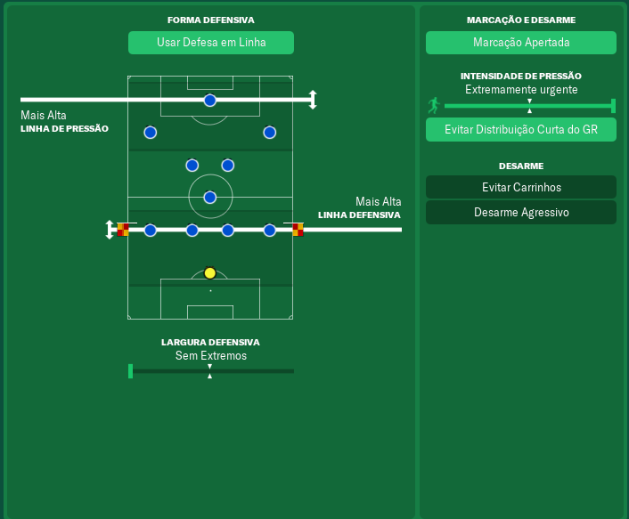

- 
    
- 
    
- 
    
- 
    

In the last 5 months or so (I'm really bad with dates), I've been improving the first **tactic** I built for **_Football Manager 2019_**. This was done using the latest official game update at the time of writing.

Before this, I was using a tactic made by some user from fmscout.com. I can't really recall which was but I had good results, yet would notice some instability in the performance every few games even against weaker adversaries. Playing with _Benfica_, I would be league champion but with one or two defeats, and a few ties. Of course, winning the _Champions League_ would be a really hard thing to accomplish.

I wanted to change that and, at the same time, build my first _FM2019_ tactic. So I began building it, tweaking and tweaking after every game until I could find a tactic that would be **good at attacking and defending**, and would also **act as a positional block in both stages of the game**.

**The secret to this was making the right and left defenders work as defensive midfielders when the team is attacking.** This allows the central midfielders to focus more on attacking, while also allowing this defenders to enter the area from time to time to score some goals.

With this and some other specificities to this tactic, I get 20+ shots against 4 to 5 from the opposite team, even in away games. Of course, if you're playing, let's say, with _Benfica_ against _Barcelona_ in their own stadium, it will be a tough game but you'll most likely win.

**Keep in mind that this tactic doesn't make miracles.** You'll most likely loose, even when playing at home, if your opponent is far better than you.

[Download the tactic](https://mega.nz/#!2FZyWYgK!Ief3lvkDxMZK8hNCRO0azxRYdMdI0Iy_-zuO5X-BlmU)
