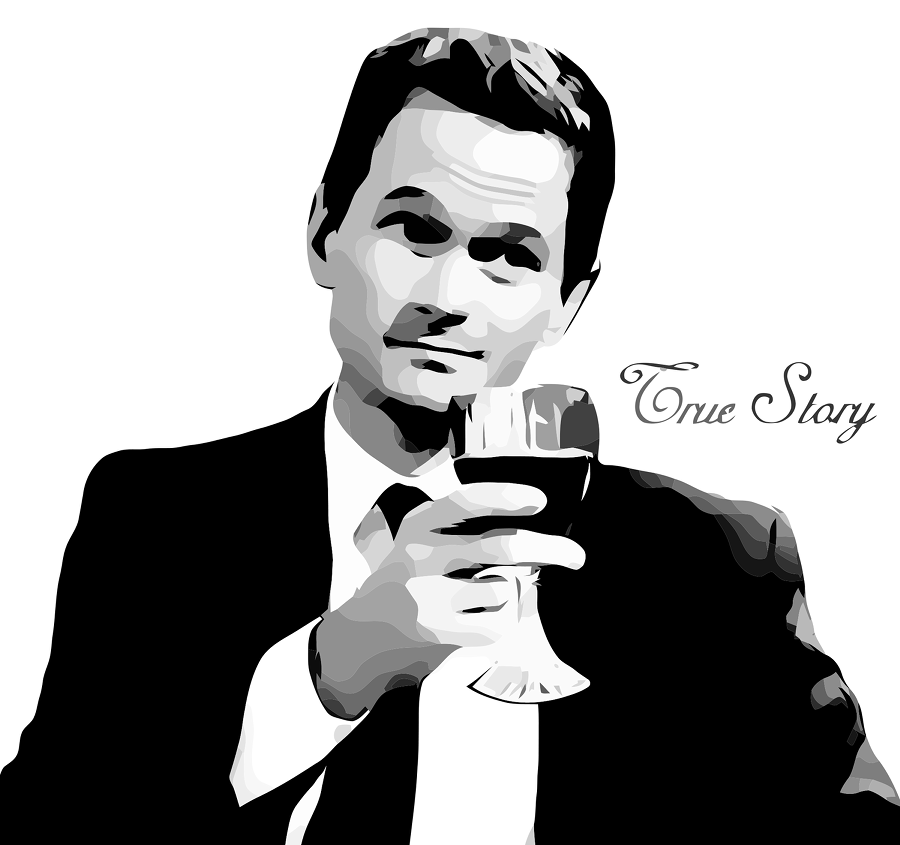

Quando quero ouvir música, habitualmente uso o _Youtube_ e o _Spotify_, com uns pós aqui e ali de _Soundcloud_, _Mixcloud_ e [_curseradio_](https://github.com/chronitis/curseradio) (que não é mais que um cliente para o _TuneIn_). Só que, de vez em quando, lá ligo a [_VPN_](https://protonvpn.com/) e acedo ao _Pandora_ para a minha dose musical. A minha conta neste serviço ainda é do tempo em que eles não tinham restrições geográficas _\[talvez já tenha feito 15 anos\]_, por isso está bastante personalizada e é uma autêntica linha temporal da evolução e mutação do meu gosto musical. Ela podia contar uma história.  

Com tantos anos, há sempre a possibilidade de surgir do nada um momento saudosista ou um figurativo murro no estômago. Ontem foi um dia em que estas duas coisas aconteceram em simultâneo, quando decidi abrir uma das _playlists_ mais antigas que tenho no _Pandora_. De repente, vi-me naqueles anos entre o final da década de 1990 e o início da década de 2000, a ter o primeiro contacto com o [**_Grande Sofá_**](http://www.rtp.pt/programa/radio/p1067), da _Antena 3_, o programa de rádio que me fez gostar da Rádio.

Já não me recordo de como comecei a ouvi-lo. Provavelmente foi por mero acaso. Mas lembro-me bem de tentar nunca perder um episódio que fosse, de adorar cada música que passava e de ficar fascinado com a voz melódica do Carlos Cardoso.

Foi este programa que me introduziu ao _Lounge_, _NuJazz_, _Dub_ e todos os outros géneros musicais que abordava. Fiquei tão fã dos estilos e do programa que cheguei a comprar o [**_Chill On Kaos Volume III_**](https://www.discogs.com/Carlos-Cardoso-Chill-On-Kaos-Volume-III-Grande-Sof%C3%A1-By-Carlos-Cardoso/release/8879211), uma coletânea que o autor do programa lançou com a _Kaos Records_. Ouvi-o durante anos - cheguei mesmo a fazer uma cópia em _Flac_, porque o que é bom é para ouvir com qualidade - até que tive a infeliz ideia de o oferecer. Mas a verdade é que ficou em boas mãos, porque quem o recebeu também o apreciava.

Tenho muitas saudades deste programa. Depois de ter chegado ao inevitável fim, comecei a afastar-me aos poucos da rádio. Ainda ouvi o _Caixa de Ritmos_ e o _Indigente_, também da _Antena 3_, algum tempo mas não eram a mesma coisa; faltava-lhes aquele _je ne sais quoi_.  

Hoje, só ouço rádio quando não quero ir em silêncio em viagem e já não tenho _plafond_ de dados ou músicas no telemóvel. As rádios nacionais vão, na sua maioria, de mal a pior. Mas pode ser que um dia alguém traga o _Grande Sofá_ de volta. Até lá, contentemo-nos com as plataformas que nos vão permitindo acesso a música em condições\*.

https://www.youtube.com/watch?v=1Irv9cHgG40

_\*por música em condições entenda-se música de que o ouvinte gosta. não deveria ser necessário fazer esta ressalva, mas..._
