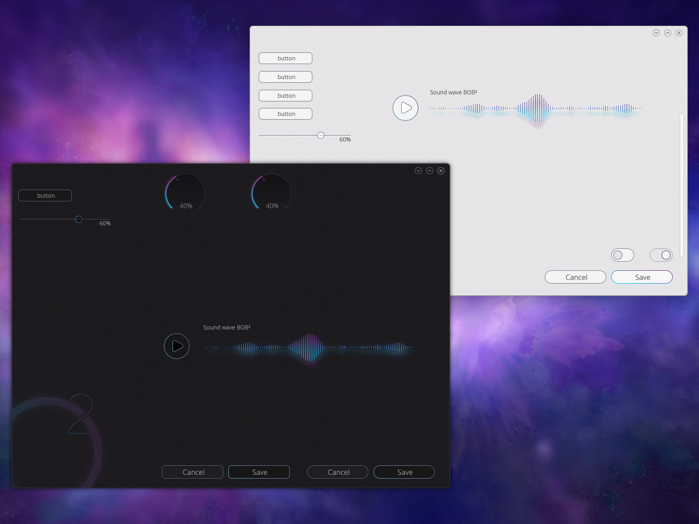
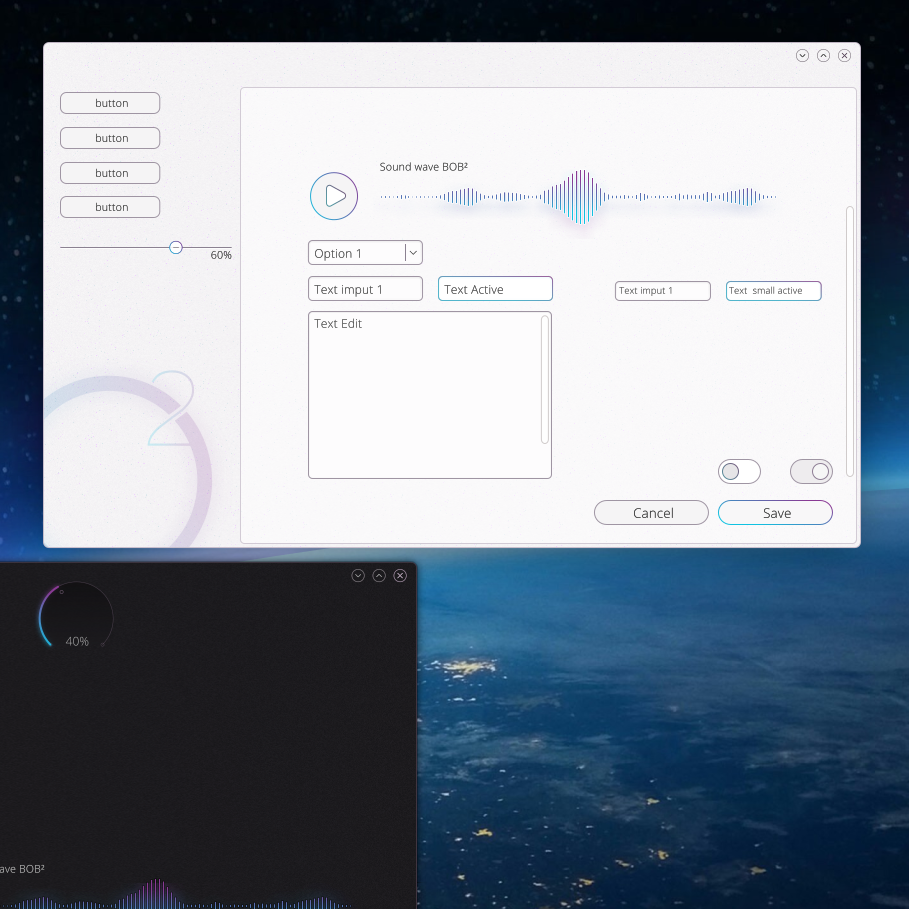
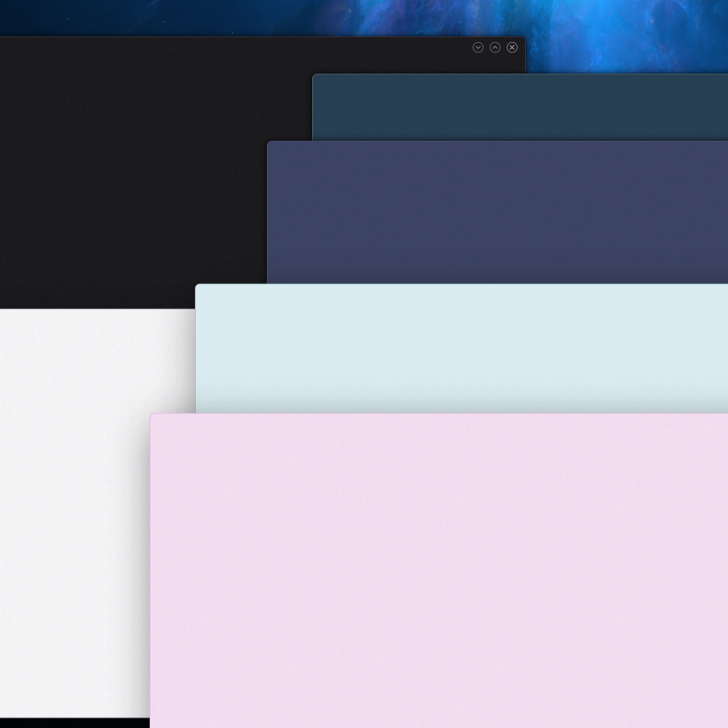

As imagens deste _post_ são de um tema _QML_, chamado O2, que o [Nuno Pinheiro](https://twitter.com/pinheirokde) anda a desenvolver. Partilho-as com a autorização dele, para que se possam babar tanto quanto eu me babei quando as vi. Mal posso ver a hora de o ver integrado no _Plasma Desktop_.
