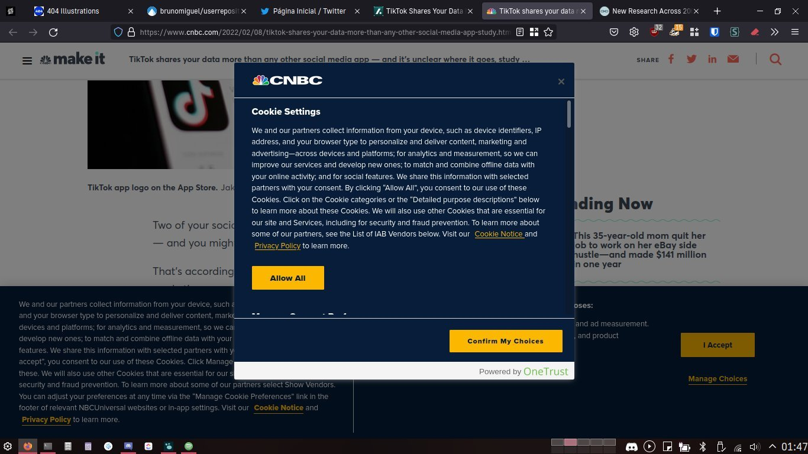
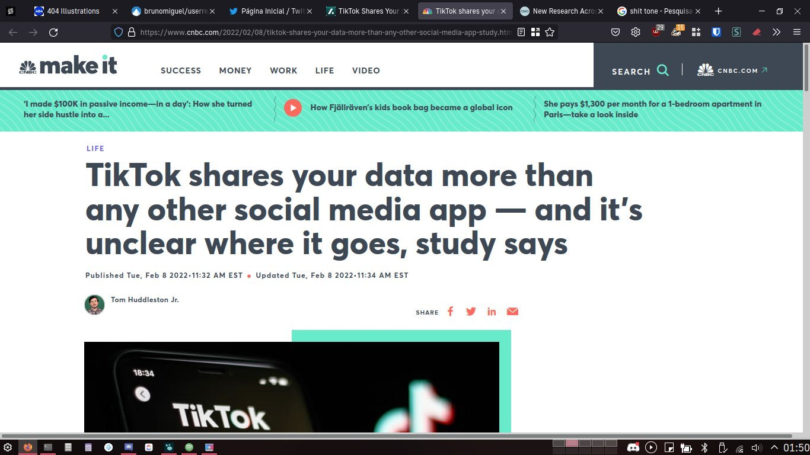

Que raio se passa com a _Web_? A quantidade de _tracking_ a que um utilizador se sujeita é para lá de surreal! Há pouco, quando entrei no site da *CNBC* para ler uma [notícia](https://www.cnbc.com/2022/02/08/tiktok-shares-your-data-more-than-any-other-social-media-app-study.html), e ainda antes de fazer a minha escolha em relação aos *cookies*, já tinha paletes deles bloqueados pelo _uBlock Origin_ e pelo _Privacy Badger_. Assim que fiz a minha escolha, a página carregou e os números mantiveram-se praticamente iguais.

Porque raio perguntam pelos *cookies* se, no final, fica tudo praticamente na mesma? É verdade que não fui confirmar se o que escolhi para ficar desativo ficou realmente bloqueado. E para quê?! O número de coisas a tentar fazer *tracking* da minha navegação continuava alto como o caraças.

As imagens abaixo mostram o antes e o depois da escolha em relação aos cookies.

### Antes

### Depois

A *CNBC* está longe de ser caso único. O *Twitter*, por exemplo, está constantemente a tentar injetar coisas. Se deixar o *browser* aberto um par de horas, tenho mais de mil elementos bloqueados pelo *adblocker*. Sim, leste bem, mais de mil! Isto é fácil de confirmar: abre o site da rede social (já com o *adblocker* ativo e *login* feito), não faças mais nada e vê o número de elementos bloqueados a aumentar. _True story._

Tenho saudades de quando navegar na web não significava ter centenas e centenas de ~~[balões](https://www.youtube.com/watch?v=IgQE7545LHs)~~ *trackers* a olhar para nós. Isto é arrepiante, para não dizer mais. Mesmo com *adblockers*, continuam a fazer *tracking* por *[Canvas](https://browserleaks.com/canvas)*, *[WebGL](https://news.ycombinator.com/item?id=26844928)* e sabe-se lá que outros métodos. De certeza que deve haver uma forma mais ética de fazer isto.

<small>_A primeira [imagem](https://unsplash.com/photos/a8CxRWIu8yw) deste post é da autoria de [Arthur Mazi](https://unsplash.com/@arthurbizkit) e foi publicada no Unsplash. A [licença](https://unsplash.com/license) está disponível no site._
_As restantes imagens são screenshots da minha autoria e estão disponíveis sob a licença Creative Commons ([CC-BY-SA-4.0](https://creativecommons.org/licenses/by-sa/4.0/))_</small>
